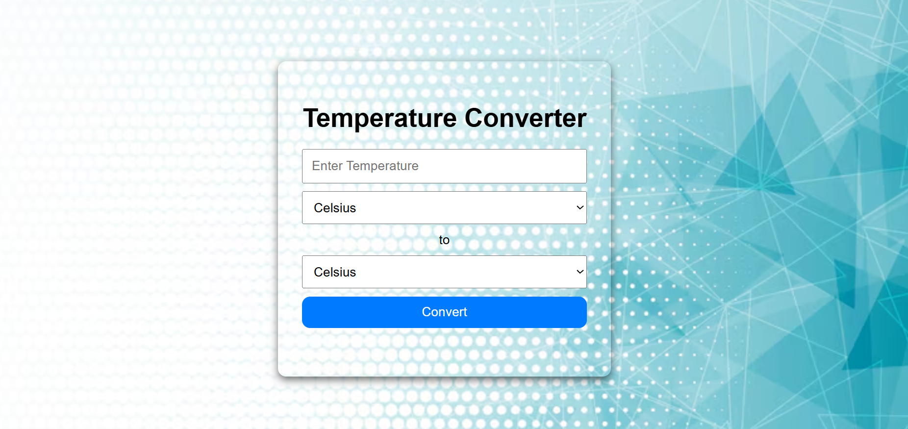

# Oasis_Infotech-_Task3
✨A simple and responsive temperature converter web app that allows users to convert values between Celsius, Fahrenheit, and Kelvin. Built using HTML, CSS, and JavaScript for quick and accurate conversions.

##  🔧 Key Features:

✅ Convert between Celsius ↔ Fahrenheit ↔ Kelvin

✅ Instant, real-time conversion on input

✅ Responsive design for mobile and desktop

✅ Clear UI with easy-to-use dropdowns or input fields

✅ No page reload or backend needed – runs fully in the browser

##  📂 Tech Stack:

✅ HTML5 – Structure

✅ CSS3 – Styling and responsiveness

✅ JavaScript – Logic for conversion

